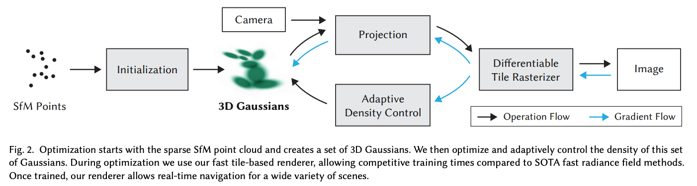
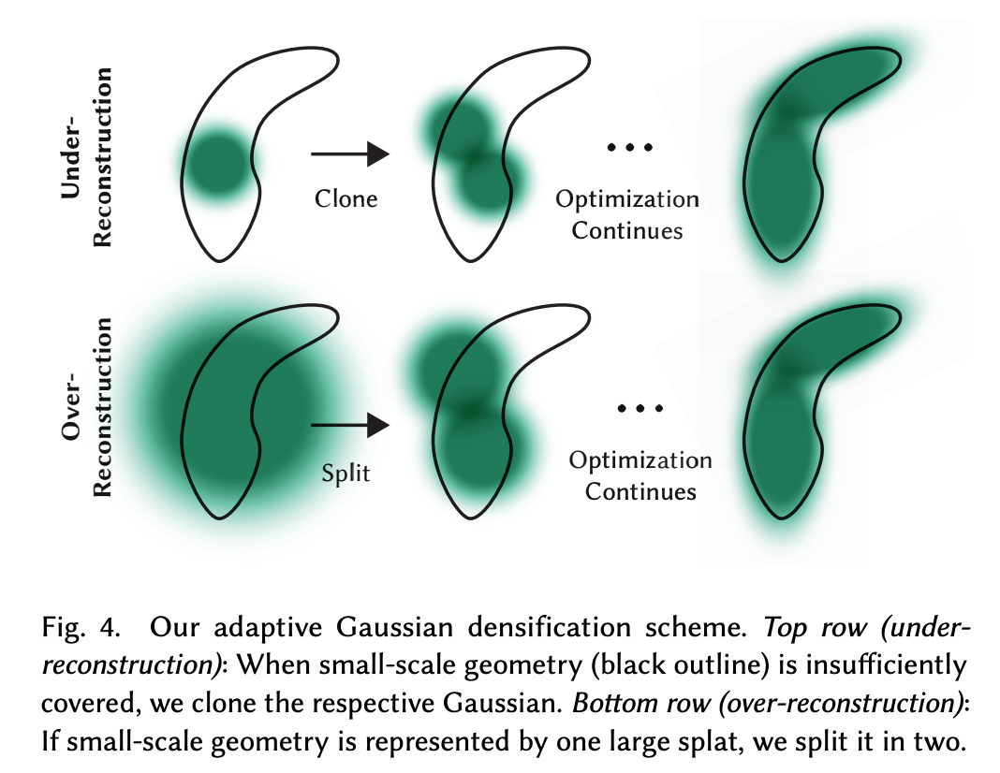
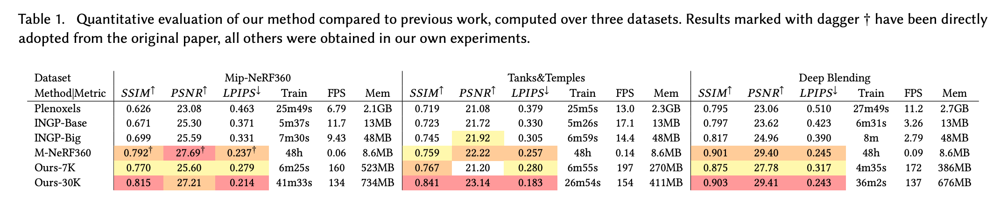

# PPRD 2023 12 11 晚18:30-20:00

## Xurk: 3DGS and Few-shot 3DGS

### 3DGS paper overview

1. 使用3D椭球表示场景

   differentiable volumetric representation, but they can also be rasterized very efficiently by projecting them to 2D, and applying standard 𝛼-blending, using an equivalent image formation model as NeRF.

2. 同时优化每个椭球的参数（位置，不透明度，各向异性协方差和球谐波系数）和椭球的密度（有多少个椭球）。

   The second component of our method is optimization of the properties of the 3D Gaussians – 3D position, opacity 𝛼, anisotropic covariance, and spherical har- monic (SH) coefficients – interleaved with adaptive density control steps, where we add and occasionally remove 3D Gaussians during optimization. 

   其中高斯分布均值为椭球位置，协方差为椭球旋转参数，球谐波系数代表颜色信息。

3. 基于tile的splats渲染方式（深入理解存疑）

   fast GPU sorting algorithms and is inspired by tile-based rasterization, fol- lowing recent work [Lassner and Zollhofer 2021]. However, thanks to our 3D Gaussian representation, we can perform anisotropic splatting that respects visibility ordering – thanks to sorting and 𝛼- blending – and enable a fast and accurate backward pass by tracking the traversal of as many sorted splats as required.

4. 性能碾压

### Few-shot Nerf and Few-shot 3DGS
    

## Ruisheng: Reshift

### Redesigned forward process

### Relation w/ LDM 

## Jiyuan: BlindSR (MANet, DCLS)

### MANNet Motivation 

### MANNet method

### DCLS Motivation 

### DCLS method