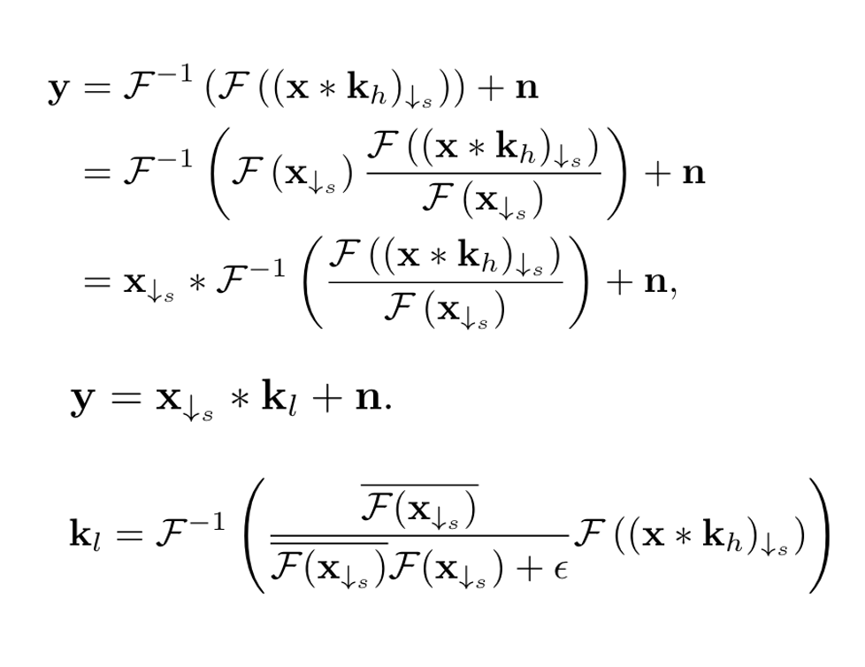
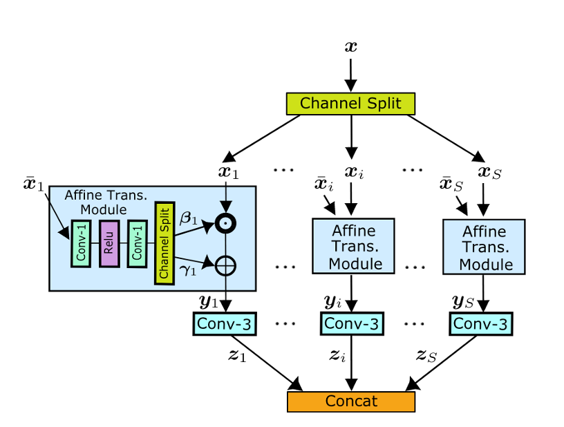

# PPRD 2023 12 11 晚18:30-20:00

## Xurk: 3DGS and Few-shot 3DGS

### 3DGS paper overview
*3D Gaussian Splatting for Real-Time Radiance Field Rendering*

1. 使用3D椭球表示场景

   differentiable volumetric representation, but they can also be rasterized very efficiently by projecting them to 2D, and applying standard 𝛼-blending, using an equivalent image formation model as NeRF.

2. 同时优化每个椭球的参数（位置，不透明度，各向异性协方差和球谐波系数）和椭球的密度（有多少个椭球）。

   The second component of our method is optimization of the properties of the 3D Gaussians – 3D position, opacity 𝛼, anisotropic covariance, and spherical har- monic (SH) coefficients – interleaved with adaptive density control steps, where we add and occasionally remove 3D Gaussians during optimization. 

   其中高斯分布均值为椭球位置，协方差为椭球旋转参数，球谐波系数代表颜色信息。

3. 基于tile的splats渲染方式（深入理解存疑）

   fast GPU sorting algorithms and is inspired by tile-based rasterization, fol- lowing recent work [Lassner and Zollhofer 2021]. However, thanks to our 3D Gaussian representation, we can perform anisotropic splatting that respects visibility ordering – thanks to sorting and 𝛼- blending – and enable a fast and accurate backward pass by tracking the traversal of as many sorted splats as required.

4. 性能碾压

### Few-shot Nerf and Few-shot 3DGS

大部分few-shot方法由于缺少足够多的视角约束，通过引入depth信息来避免过拟合到特定视角上。其中depth有相对深度和绝对深度的区别，也有稀疏深度和稠密深度的躯壳，不同paper的使用方式有一些排列组合的差异。具体的监督方式存在有depth上的pixel-wise监督或者KL散度监督。在3DGS中，depth的监督如下：

*FSGS: Real-Time Few-shot View Synthesis using Gaussian Splatting*

使用depth引导稀疏SFM初始化插值，另外引入Depth监督。

*SparseGS: Real-Time 360° Sparse View Synthesis using Gaussian Splatting* 

## Ruisheng: Reshift

*Efficient Diffusion Model for Image Super-resolution by Residual Shifting*

一篇inspiring的工作。

### Redesigned Framework

本文的设计动机（很多文章都有类似的动机，即直接从高斯噪声出发不适合SR，但是解决办法很多比较揉面，如DiffIR）

> The reasonable diffusion model for SR should start from a prior distribution based on the LR image

本文重新设计了diffusion的forward process，一般DM的forward process公式如下：

本文重新设计的forward process公式如下：

主要的区别在于均值项的变化。

由于重新修改了diffusion的过程，这里文章进一步做了两方面的说明，其一是其每一步的过渡是平滑的，其二是边缘概率分布的收敛方向。

反向过程根据正向过程推导得出。

文章采用了geometirc schedule，而非常见的linear或者cosine/sine。

### Relation w/ LDM 

有趣的是，当本文方法以特定参数进行forward process时，几乎和LDM的前向过程一致，说明方法包含了从高斯噪声出发的扩散过程。

## Jiyuan: BlindSR (MANet, DCLS)

### DCLS  

*Deep Constrained Least Squares for Blind Image Super-Resolution*

Kernel and HR image both belong to the HR space, and there is a gap with the LR image.

### MANet 

*Mutual Affine Network for Spatially Variant Kernel Estimation in Blind Image Super-Resolution*

Spatially invariant blur kernels lead to performance degradation in practical applications.

The spatial variation kernel requires more learning content, and increasing channels will increase model training and inference time.

