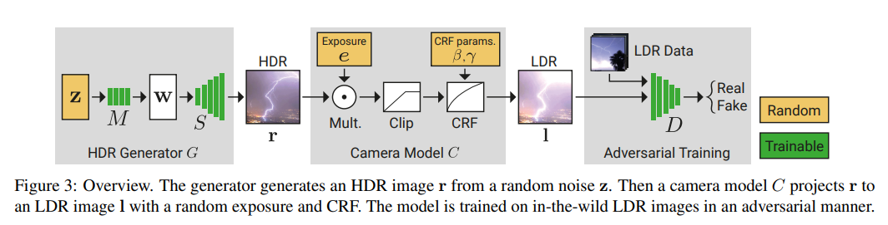

# PPRD 2023-12-11 

腾讯会议晚18:30-20:00

## Guanys: HDR papers

### Paper overview

*GlowGAN: Unsupervised Learning of HDR Images from LDR Images in the Wild*

基于GAN使用无监督的方法学习HDR distribution. 其中generator可以直接从noise产生HDR，训练好的generator结合GAN inversion可以完成single HDR的setting. 这个范式可以迁移到更多任务上。

*HDR-NeRF: High Dynamic Range Neural Radiance Fields*

