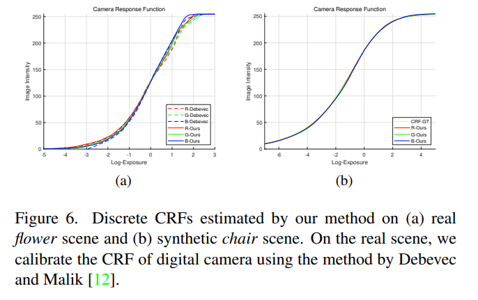

# PPRD 2023-12-11 

腾讯会议晚18:30-20:00

## Guanys: HDR papers

### Paper overview

*GlowGAN: Unsupervised Learning of HDR Images from LDR Images in the Wild*

基于GAN使用无监督的方法学习HDR distribution. 其中generator可以直接从noise产生HDR，训练好的generator结合GAN inversion可以完成single HDR的setting. 这个范式可以迁移到更多任务上。

*HDR-NeRF: High Dynamic Range Neural Radiance Fields*

首先最主要的改进是，传统的nerf基于光线位置和角度直接得到color和density两个属性，但是这里HDR Nerf得到的是radiance和density，然后引入相机成像过程的原理，即光线在拜尔传感器上经历曝光时间$\delta t$的累积得到tonemap后的RGB的颜色信息。而如果不tonemap就是原来场景的radiance。另外，一般对于RGB三个通道的CRF函数是不同的，所以这里分了三个MLP来从radiance映射到RGB颜色信息。

文章里补充了关于CRF估计的结果与真实CRF的对比。

此外值得关注的是其监督loss不只有已知视角之间的loss，还有一个unit exposure loss

如果没有这个单位曝光时间下的颜色约束，全局的radience会与真实的radience有一个比例因子的差距，正比但是不相等。这体现在图像中如下图所示：

